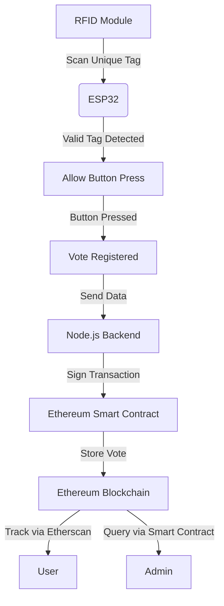

# Decentralized Voting System with RFID and ESP32

## Overview
This project is a decentralized voting system that integrates an RFID module, four buttons, and an ESP32 microcontroller. The system ensures secure and autonomous vote registration on the Ethereum blockchain through a Node.js backend. The entire transaction process is automated, allowing votes to be tracked on Etherscan or queried via smart contract functions.

## Features
- **RFID Authentication:** Each RFID tag can be used only once per voting cycle.
- **Button-Based Voting:** The system supports four distinct voting options, each represented by a button.
- **ESP32 Integration:** Handles RFID scanning and button inputs, communicating with the backend server.
- **Node.js Backend:** Manages Ethereum transaction signing and submission.
- **Smart Contract on Ethereum:** Stores votes securely on the blockchain.
- **Blockchain Transparency:** Votes can be tracked via Etherscan or retrieved through the smart contract.
- **Tamper-Proof:** Since the voting records are on the blockchain, they cannot be altered or deleted.
- **Decentralization:** No single entity controls the voting process, ensuring fairness and trust.

## System Architecture


## Hardware Requirements
- ESP32 Dev Module
- RFID Module (e.g., MFRC522)
- RFID Tags
- 4 Push Buttons
- LED Indicator (optional)
- Power Supply

## Software Requirements
- Arduino IDE (for ESP32 programming)
- Node.js & npm
- Hardhat or Remix (for smart contract deployment)
- Alchemy API (for blockchain interactions)
- MetaMask Wallet

## Installation and Setup
### 1. Flashing the ESP32
1. Connect the ESP32 to your computer via USB.
2. Open the Arduino IDE and install the required libraries:
   - `MFRC522` for RFID
   - `WiFi` for network connectivity
   - `HTTPClient` for sending data to the backend
3. Upload the `ESP32_RFID_Voting.ino` sketch to the ESP32.

### 2. Setting Up the Backend
1. Clone this repository:
   ```sh
   git clone https://github.com/your-username/decentralized-voting
   cd decentralized-voting
   ```
2. Install dependencies:
   ```sh
   npm install
   ```
3. Configure `.env` file with Alchemy API key and wallet details.
4. Start the server:
   ```sh
   node server.js
   ```

### 3. Deploying the Smart Contract
1. Navigate to the `smart-contract` folder.
2. Compile and deploy the contract using Hardhat:
   ```sh
   npx hardhat run scripts/deploy.js --network sepolia
   ```
3. Copy the deployed contract address and update the backend configuration.

## Smart Contract Details
The smart contract, deployed at **0x79846Ce1a66e2288051Eb9D51045cA9Ab14C4eF0**, ensures secure and transparent vote storage on the Ethereum blockchain. It prevents duplicate voting by tracking RFID tag usage and allows retrieval of voting data through blockchain queries. Additionally, it provides a mechanism to determine the winner based on the highest number of votes.

### Smart Contract Functionality
- **castVote:** Records a vote by linking an RFID tag to a specific button press and stores it on the blockchain.
- **getVoteCount:** Returns the total number of votes cast.
- **getVote:** Retrieves details of a specific vote, including the RFID tag, button pressed, and timestamp.
- **pickWinner:** Identifies the button with the highest votes and declares it as the winner.
- **resetVote:** Allows the owner to reset a vote for a specific RFID tag.

## Usage
1. Scan an RFID tag to authenticate.
2. Press one of the four voting buttons.
3. The vote is signed and submitted automatically to the Ethereum blockchain.
4. Verify the transaction on Etherscan or interact with the contract directly.

## Tracking Votes
- **Etherscan:** Search for transactions using the smart contract address.
- **Smart Contract Call:** Use `getVoteCount()` to retrieve vote counts.

## Security Measures
- **RFID Tag Uniqueness:** Each tag can be used only once per voting cycle to prevent duplicate votes.
- **Encrypted Transactions:** Transactions are signed and encrypted using Ethereum cryptographic protocols.
- **Tamper-Proof Records:** Blockchain ensures that once a vote is stored, it cannot be altered.
- **Private Key Security:** Private keys are stored securely on the backend and never exposed.

## License
This project is licensed under the MIT License.

## Contributing
Pull requests are welcome! Feel free to improve the project and submit changes.

## Acknowledgments
- Ethereum documentation for blockchain interactions.
- Hardhat for simplifying smart contract deployment.
- Community contributions for improving transparency in voting systems.

