# Decentralized Voting System with RFID and ESP32


## Overview

This project is a decentralized voting system that integrates an RFID module, four buttons, and an ESP32 microcontroller. The system ensures secure and autonomous vote registration on the Ethereum blockchain through a Node.js backend. The entire transaction process is automated, allowing votes to be tracked on Etherscan or queried via smart contract functions.

## Working Video

[https://github.com/user-attachments/assets/64d15e4b-c856-4909-84e9-2cc59c6519dd](https://github.com/user-attachments/assets/64d15e4b-c856-4909-84e9-2cc59c6519dd)

---

## Features

### 🌐 Web-based Voting Interface !!s🌟NEW ADDITION

Modern React web application with MetaMask integration for browser-based voting.

* **RFID Authentication:** Each RFID tag can be used only once per voting cycle.
* **Button-Based Voting:** The system supports four distinct voting options, each represented by a button.
* **ESP32 Integration:** Handles RFID scanning and button inputs, communicating with the backend server.
* **Node.js Backend:** Manages Ethereum transaction signing and submission.
* **Smart Contract on Ethereum:** Stores votes securely on the blockchain.
* **Blockchain Transparency:** Votes can be tracked via Etherscan or retrieved through the smart contract.
* **Tamper-Proof:** Voting records on the blockchain cannot be altered or deleted.
* **Decentralization:** No single entity controls the voting process, ensuring fairness and trust.

---

## System Architecture

```mermaid
flowchart TD
    A[RFID + ESP32 Hardware] -->|Scans RFID Tag| B[ESP32 Firmware]
    B -->|Sends vote & tag to| C[Smart Contract]
    D[React Frontend 🧠] -->|Cast vote using Tag ID + Button| C
    D -->|View votes, declare winner| C
    D -->|Real-time tracking & dashboard| C
    C -->|Stores vote on| E[(Ethereum Blockchain)]
    D -->|Query vote status, results| C
    B -->|Displays LED result| F[LED Feedback System]
    D -->|Admin tools: reset tags, pick winner| C

```



---

## Hardware Requirements

* ESP32 Dev Module
* RFID Module (e.g., MFRC522)
* RFID Tags
* 4 Push Buttons
* LED Indicator (optional)
* Power Supply

## Software Requirements

* Arduino IDE (for ESP32 programming)
* Node.js & npm
* Hardhat or Remix (for smart contract deployment)
* Alchemy API (for blockchain interactions)
* MetaMask Wallet
* React & Ethers.js !!NEW ADDITION - For web interface

---

## Installation and Setup

### 1. Flashing the ESP32

* Connect the ESP32 to your computer via USB.
* Open the Arduino IDE and install the required libraries:

  * `MFRC522` for RFID
  * `WiFi` for network connectivity
  * `HTTPClient` for sending data to the backend
* Upload the `ESP32_RFID_Voting.ino` sketch to the ESP32.

### 2. Setting Up the Backend

```bash
git clone https://github.com/your-username/decentralized-voting
cd decentralized-voting
npm install
```

* Configure `.env` with Alchemy API key and wallet details.

```bash
node server.js
```

### 3. Deploying the Smart Contract

```bash
cd smart-contract
npx hardhat run scripts/deploy.js --network sepolia
```

* Copy the deployed contract address and update both backend and frontend configs.

---

## 🚀 NEW ADDITION: React Web Frontend

### ✨ Modern Web Interface Features

* 🔗 MetaMask Wallet Integration
* 🗳️ Web-Based Voting
* 📊 Real-Time Dashboard
* 👑 Admin Panel
* 🔍 Smart Query System
* 📱 Fully Responsive
* 🎨 Glass Morphism Design
* ⚡ Live Updates

### 🛠️ Frontend Setup

### Dashboard common for all users


### Owner only dashboard (for election commission)


```bash
cd frontend
npm install
echo "REACT_APP_CONTRACT_ADDRESS=0x79846Ce1a66e2288051Eb9D51045cA9Ab14C4eF0" > .env
npm start
```

---

## 🎯 Web Voting Process

1. Visit [http://localhost:3000](http://localhost:3000)
2. Connect MetaMask
3. Enter RFID Tag ID
4. Select Button (1-4)
5. Cast Vote and confirm in MetaMask
6. View real-time vote tally

---

## 🎨 Interface Components

### 🗳️ Voting Section

* Form for tag ID and button
* Real-time validation
* Transaction status with animations

### 📊 Results Dashboard

* Animated vote counters
* Winner highlight
* Full vote history

### 🔍 Query Tools

* Tag Checker
* Button Vote Stats
* Search by tag/button

### 👑 Admin Panel (Owner Only)

* Pick Winner
* Reset Votes
* Transfer Ownership
* Refresh Blockchain Data

### 🎨 Visual Design

* Glass Morphism Effects
* Gradient Animations
* Mobile-First Layout
* Loading Spinners
* Color-Coded Status Feedback

---

## \U0001F512 Security Features

* Client-side Validation
* MetaMask Wallet Safety
* Direct Smart Contract Access
* Transaction Confirmations

---

## Smart Contract Details

Deployed at: `0x79846Ce1a66e2288051Eb9D51045cA9Ab14C4eF0`

### Functions:

* `castVote(tagId, button)`: Casts a vote.
* `getVoteCount()`: Returns total vote count.
* `getVote(index)`: Fetches vote details.
* `pickWinner()`: Declares winning button.
* `resetVote(tagId)`: Resets a tag's vote.
* `hasVoted(tagId)`: ✨ NEW - Check tag voting status
* `buttonVotes(button)`: ✨ NEW - Vote count for button

---

## Usage

### Hardware Voting (Original)

* Scan RFID Tag
* Press Button (1-4)
* Vote submitted via ESP32 to backend
* Verified on blockchain

### \U0001F310 Web Voting (NEW)

* Open browser React App
* Connect MetaMask
* Enter Tag and select button
* Submit and confirm transaction
* View real-time dashboard

---

## Tracking Votes

* **Etherscan:** View blockchain transactions
* **Smart Contract Functions:** Call `getVoteCount()` or `getVote()`
* **Web Dashboard:** Real-time visual results

---

## Security Measures

* Unique RFID Tag Enforcement
* Encrypted Transactions
* Immutable Blockchain Storage
* Backend Private Key Safety
* MetaMask Client Security

---
